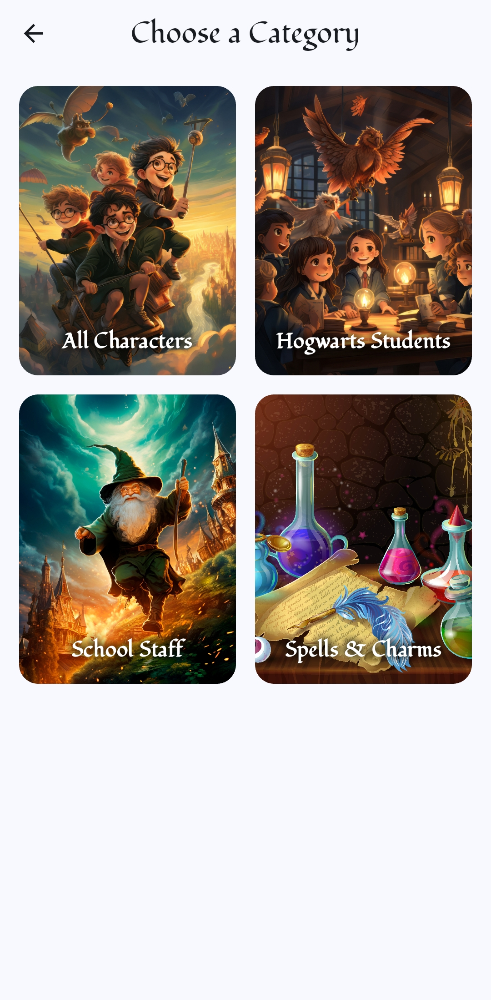
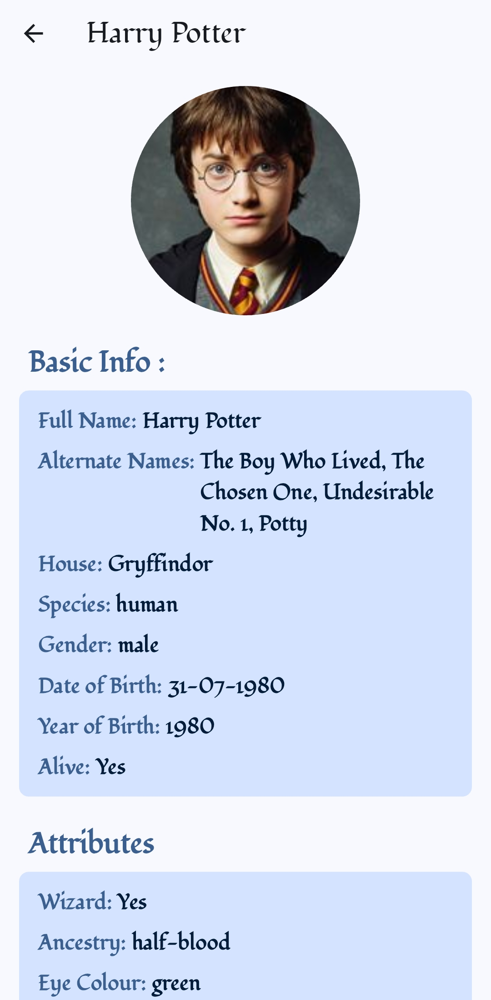

# 🧙‍♂️ Wizard Cards

Harry Potter evrenine ait karakter, büyü ve diğer öğeleri listeleyen basit bir Flutter uygulaması.

## 🎯 Proje Amacı

Bu uygulama, [HP API](https://hp-api.onrender.com/) üzerinden alınan verileri kullanıcıya sade bir arayüzle sunmak amacıyla geliştirilmiştir. Amaç, Flutter ile BLoC yapısını kullanarak REST API'den veri çekme ve bu verileri listeleme deneyimi kazanmaktır.

## 🚀 APK Dosyası

👉 [Uygulamayı indir ve dene](https://drive.google.com/file/d/1xUpylFzrxp2WVTyLH9LIyFYcZxH0wSfh/view?usp=drive_link)

## 🛠️ Kullanılan Teknolojiler

- Flutter
- Dart
- BLoC State Management
- Dio (HTTP İstekleri için)

## 📸 Ekran Görüntüleri

  
  
  
  
  

## ⚙️ Kurulum ve Çalıştırma

1. Bu repoyu klonla
2. Gerekli paketleri yükle , `flutter pub get` komutunu çalıştır.
3. Uygulamayı çalıştır , main.dart dosyasını çalıştırarak uygulamayı başlat.
